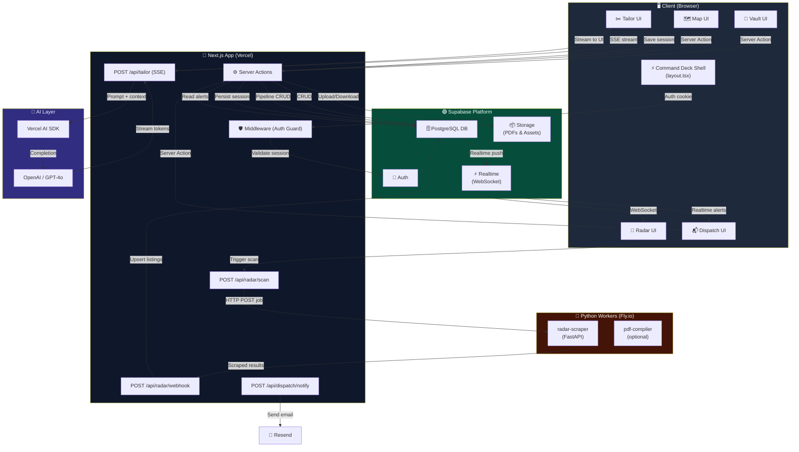

# 🗺️ Atlas — Project Structure

> **Atlas** is a Next.js 14 career management platform built on a turborepo monorepo. Five discrete product modules — **Vault**, **Radar**, **Map**, **Tailor**, and **Dispatch** — are unified under the **Command Deck** shell.

---

## 📁 Annotated Directory Tree

```
atlas/                                  # 🌐 Monorepo root (Turborepo)
│
├── 📦 apps/
│   └── web/                            # Next.js 14 App Router application
│       │
│       ├── app/                        # App Router root — all routes live here
│       │   │
│       │   ├── (auth)/                 # 🔐 Route group: unauthenticated pages
│       │   │   ├── login/
│       │   │   │   └── page.tsx        # Login page (email/password + OAuth)
│       │   │   ├── register/
│       │   │   │   └── page.tsx        # New account registration
│       │   │   ├── forgot-password/
│       │   │   │   └── page.tsx        # Password reset request
│       │   │   └── layout.tsx          # Auth layout (centered card, no sidebar)
│       │   │
│       │   ├── (dashboard)/            # 🛡️ Route group: all protected pages
│       │   │   ├── layout.tsx          # ⚡ Command Deck shell (sidebar + topbar)
│       │   │   │
│       │   │   ├── vault/              # 🏦 THE VAULT — Resume & Document Store
│       │   │   │   ├── page.tsx        # Vault dashboard (document grid)
│       │   │   │   ├── [id]/
│       │   │   │   │   ├── page.tsx    # Single document viewer/editor
│       │   │   │   │   └── edit/
│       │   │   │   │       └── page.tsx  # Rich text document editor
│       │   │   │   └── upload/
│       │   │   │       └── page.tsx    # Document upload & parsing flow
│       │   │   │
│       │   │   ├── radar/              # 📡 ATLAS RADAR — Job Discovery Engine
│       │   │   │   ├── page.tsx        # Radar home (active scans overview)
│       │   │   │   ├── scan/
│       │   │   │   │   ├── page.tsx    # Create / manage scan configurations
│       │   │   │   │   └── [id]/
│       │   │   │   │       └── page.tsx  # Scan detail & results
│       │   │   │   └── results/
│       │   │   │       └── page.tsx    # Aggregated job listings feed
│       │   │   │
│       │   │   ├── map/                # 🗺️ ATLAS MAP — Application Pipeline
│       │   │   │   ├── page.tsx        # Kanban board (main pipeline view)
│       │   │   │   ├── [applicationId]/
│       │   │   │   │   └── page.tsx    # Application detail drawer/page
│       │   │   │   └── analytics/
│       │   │   │       └── page.tsx    # Pipeline metrics & conversion charts
│       │   │   │
│       │   │   ├── tailor/             # ✂️ TAILOR ENGINE — AI Resume Customizer
│       │   │   │   ├── page.tsx        # Tailor dashboard (recent sessions)
│       │   │   │   ├── session/
│       │   │   │   │   ├── new/
│       │   │   │   │   │   └── page.tsx  # Start new tailoring session
│       │   │   │   │   └── [id]/
│       │   │   │   │       └── page.tsx  # Active tailoring workspace
│       │   │   │   └── history/
│       │   │   │       └── page.tsx    # Past tailored resume versions
│       │   │   │
│       │   │   └── dispatch/           # 📬 DISPATCH — Notifications & Outreach
│       │   │       ├── page.tsx        # Dispatch inbox (alerts & follow-ups)
│       │   │       ├── compose/
│       │   │       │   └── page.tsx    # Compose outreach email / message
│       │   │       └── settings/
│       │   │           └── page.tsx    # Notification preferences
│       │   │
│       │   ├── api/                    # 🔌 Next.js API Routes (Route Handlers)
│       │   │   │
│       │   │   ├── radar/
│       │   │   │   ├── scan/
│       │   │   │   │   └── route.ts    # POST: trigger a new Radar scan job
│       │   │   │   └── webhook/
│       │   │   │       └── route.ts    # POST: receive results from Python scraper worker
│       │   │   │
│       │   │   ├── tailor/
│       │   │   │   └── route.ts        # POST: stream AI tailoring response (SSE)
│       │   │   │
│       │   │   └── dispatch/
│       │   │       └── notify/
│       │   │           └── route.ts    # POST: trigger notification dispatch
│       │   │
│       │   └── actions/                # ⚙️ Server Actions (type-safe mutations)
│       │       ├── vault.actions.ts    # CRUD for resumes & documents
│       │       ├── map.actions.ts      # Application pipeline state mutations
│       │       ├── tailor.actions.ts   # Save tailoring sessions & outputs
│       │       ├── dispatch.actions.ts # Mark notifications read, schedule alerts
│       │       └── auth.actions.ts     # Sign in, sign out, session management
│       │
│       ├── components/                 # 🧩 All React components
│       │   │
│       │   ├── ui/                     # 🎨 shadcn/ui primitives (auto-generated)
│       │   │   ├── button.tsx
│       │   │   ├── card.tsx
│       │   │   ├── dialog.tsx
│       │   │   ├── input.tsx
│       │   │   ├── badge.tsx
│       │   │   └── ...                 # Full shadcn component library
│       │   │
│       │   ├── vault/                  # Vault-scoped components
│       │   │   ├── DocumentCard.tsx    # Resume/doc thumbnail card
│       │   │   ├── DocumentGrid.tsx    # Masonry grid of documents
│       │   │   ├── ResumeEditor.tsx    # Rich text / block editor
│       │   │   ├── UploadDropzone.tsx  # Drag-and-drop file upload
│       │   │   └── ParseProgress.tsx   # AI parsing progress indicator
│       │   │
│       │   ├── radar/                  # Radar-scoped components
│       │   │   ├── ScanConfigForm.tsx  # Form to configure job scan params
│       │   │   ├── JobCard.tsx         # Individual job listing card
│       │   │   ├── JobFeed.tsx         # Infinite-scroll job results list
│       │   │   ├── ScanStatusBadge.tsx # Live scan status indicator
│       │   │   └── FiltersPanel.tsx    # Job filter sidebar
│       │   │
│       │   ├── map/                    # Map-scoped components
│       │   │   ├── KanbanBoard.tsx     # Drag-and-drop pipeline board
│       │   │   ├── KanbanColumn.tsx    # Single pipeline stage column
│       │   │   ├── ApplicationCard.tsx # Kanban card for one application
│       │   │   ├── ApplicationDrawer.tsx # Slide-out detail panel
│       │   │   └── PipelineChart.tsx   # Recharts conversion funnel
│       │   │
│       │   ├── tailor/                 # Tailor-scoped components
│       │   │   ├── TailoringWorkspace.tsx # Split-pane editor + AI chat
│       │   │   ├── SuggestionPanel.tsx # AI suggestion cards
│       │   │   ├── DiffViewer.tsx      # Before/after resume diff view
│       │   │   └── JobContextPanel.tsx # Job description reference panel
│       │   │
│       │   ├── dispatch/               # Dispatch-scoped components
│       │   │   ├── NotificationFeed.tsx # Real-time notification list
│       │   │   ├── AlertCard.tsx       # Single alert/notification card
│       │   │   ├── OutreachComposer.tsx # Email/message composition UI
│       │   │   └── FollowUpReminder.tsx # Follow-up scheduling widget
│       │   │
│       │   └── shared/                 # 🔁 Cross-module shared components
│       │       │
│       │       ├── command-deck/       # ⚡ The Command Deck shell components
│       │       │   ├── CommandDeck.tsx     # Root shell wrapper
│       │       │   ├── Sidebar.tsx         # Collapsible navigation sidebar
│       │       │   ├── SidebarNav.tsx      # Module navigation links
│       │       │   ├── TopBar.tsx          # Global header (search, user menu)
│       │       │   ├── CommandPalette.tsx  # ⌘K global command palette
│       │       │   └── MobileNav.tsx       # Bottom nav for mobile viewports
│       │       │
│       │       ├── telemetry/          # 📊 App-wide analytics & monitoring
│       │       │   ├── Analytics.tsx       # PostHog / analytics provider
│       │       │   └── ErrorBoundary.tsx   # React error boundary wrapper
│       │       │
│       │       └── forms/              # 📝 Reusable form components
│       │           ├── FormField.tsx       # Labeled input wrapper
│       │           ├── SearchInput.tsx     # Debounced search input
│       │           └── DatePicker.tsx      # Date selection input
│       │
│       ├── lib/                        # 🔧 Core library code (non-component)
│       │   │
│       │   ├── supabase/               # Supabase client configuration
│       │   │   ├── client.ts           # Browser-side Supabase client
│       │   │   ├── server.ts           # Server-side Supabase client (cookies)
│       │   │   ├── middleware.ts       # Auth session refresh middleware
│       │   │   └── queries/            # Typed query helpers
│       │   │       ├── vault.queries.ts
│       │   │       ├── radar.queries.ts
│       │   │       ├── map.queries.ts
│       │   │       └── tailor.queries.ts
│       │   │
│       │   ├── ai/                     # AI / LLM integration layer
│       │   │   ├── client.ts           # OpenAI / Vercel AI SDK setup
│       │   │   ├── prompts/            # Prompt templates
│       │   │   │   ├── tailor.prompt.ts   # Resume tailoring system prompt
│       │   │   │   └── parse.prompt.ts    # Document parsing prompt
│       │   │   └── tools/              # AI SDK tool definitions
│       │   │       └── resume.tools.ts
│       │   │
│       │   ├── pdf/                    # PDF generation & parsing
│       │   │   ├── generator.ts        # React-PDF resume generator
│       │   │   └── parser.ts           # PDF-to-text extraction utility
│       │   │
│       │   ├── radar/                  # Radar business logic
│       │   │   ├── scheduler.ts        # Scan scheduling (cron / queue)
│       │   │   ├── normalizer.ts       # Job listing data normalizer
│       │   │   └── scorer.ts           # Job relevance scoring algorithm
│       │   │
│       │   └── utils/                  # General utilities
│       │       ├── cn.ts               # clsx + tailwind-merge helper
│       │       ├── date.ts             # Date formatting helpers
│       │       ├── string.ts           # String manipulation helpers
│       │       └── validation.ts       # Zod schema helpers
│       │
│       ├── types/                      # 📐 Global TypeScript type definitions
│       │   ├── database.types.ts       # Auto-generated Supabase DB types
│       │   ├── vault.types.ts          # Vault domain types
│       │   ├── radar.types.ts          # Radar & job listing types
│       │   ├── map.types.ts            # Application pipeline types
│       │   ├── tailor.types.ts         # Tailoring session types
│       │   └── dispatch.types.ts       # Notification & dispatch types
│       │
│       ├── middleware.ts               # Next.js middleware (auth guard)
│       ├── next.config.ts              # Next.js configuration
│       ├── tailwind.config.ts          # Tailwind CSS configuration
│       └── tsconfig.json               # TypeScript configuration
│
├── 📦 packages/
│   │
│   ├── database/                       # 🗄️ Database package (shared schema)
│   │   ├── migrations/                 # Supabase SQL migration files
│   │   │   ├── 0001_create_vault.sql
│   │   │   ├── 0002_create_radar.sql
│   │   │   ├── 0003_create_map.sql
│   │   │   ├── 0004_create_tailor.sql
│   │   │   └── 0005_create_dispatch.sql
│   │   ├── seed/                       # Development seed data
│   │   │   └── seed.sql
│   │   ├── schema.ts                   # Drizzle ORM schema definitions
│   │   └── package.json
│   │
│   └── shared/                         # 🤝 Cross-app shared utilities
│       ├── constants/                  # App-wide constants
│       │   └── index.ts
│       ├── validators/                 # Shared Zod validation schemas
│       │   ├── vault.schema.ts
│       │   ├── radar.schema.ts
│       │   └── map.schema.ts
│       └── package.json
│
├── 🤖 workers/
│   │
│   ├── radar-scraper/                  # Python job scraping microservice
│   │   ├── src/
│   │   │   ├── main.py                 # FastAPI entrypoint
│   │   │   ├── scrapers/               # Platform-specific scrapers
│   │   │   │   ├── linkedin.py
│   │   │   │   ├── indeed.py
│   │   │   │   └── greenhouse.py
│   │   │   ├── models.py               # Pydantic data models
│   │   │   └── webhook.py              # Result callback to Next.js API
│   │   ├── requirements.txt
│   │   ├── Dockerfile
│   │   └── fly.toml                    # Fly.io deployment config
│   │
│   └── pdf-compiler/                   # PDF generation worker (optional)
│       ├── src/
│       │   └── main.py                 # FastAPI PDF compilation endpoint
│       ├── requirements.txt
│       └── Dockerfile
│
├── 📚 docs/                            # Project documentation
│   ├── project-structure.md            # ← This file
│   ├── tech-stack.md                   # Technology decisions & setup
│   ├── modules/                        # Per-module deep dives
│   │   ├── vault.md
│   │   ├── radar.md
│   │   ├── map.md
│   │   ├── tailor.md
│   │   └── dispatch.md
│   └── adr/                            # Architecture Decision Records
│       └── 0001-app-router.md
│
├── turbo.json                          # Turborepo pipeline configuration
├── package.json                        # Root package.json (workspaces)
├── pnpm-workspace.yaml                 # pnpm workspace definition
└── .env.example                        # Environment variable template
```

---

## 🏗️ Module Boundary Explanations

Atlas is divided into five bounded contexts, each encapsulating its own UI, API, and data concerns. Modules communicate through well-defined interfaces (Server Actions, API routes, and the shared Supabase schema) — never by importing directly across module folders.

### 🏦 Vault — The Document Store
> *"Your professional identity, versioned."*

The Vault is the **source of truth** for all user documents: base resumes, cover letter templates, portfolios, and certificates. It owns document upload, AI-powered parsing (extracting structured data from PDFs), and rich-text editing. Every other module reads from Vault but never writes to it directly.

| Concern | Location |
|---|---|
| UI Pages | `app/(dashboard)/vault/` |
| Components | `components/vault/` |
| Server Actions | `actions/vault.actions.ts` |
| DB Queries | `lib/supabase/queries/vault.queries.ts` |
| Types | `types/vault.types.ts` |

---

### 📡 Radar — The Job Discovery Engine
> *"Continuous signal, filtered to your frequency."*

Radar runs persistent, configurable job scans across multiple platforms (LinkedIn, Indeed, Greenhouse, etc.) via the Python `radar-scraper` worker. Results are normalised, scored for relevance, and streamed back to the user's feed via a webhook. The scan scheduler ensures users always have fresh leads without manual searching.

| Concern | Location |
|---|---|
| UI Pages | `app/(dashboard)/radar/` |
| Components | `components/radar/` |
| API Routes | `api/radar/scan/`, `api/radar/webhook/` |
| Business Logic | `lib/radar/` |
| Python Worker | `workers/radar-scraper/` |

---

### 🗺️ Map — The Application Pipeline
> *"Every opportunity, tracked from signal to offer."*

Map is a Kanban-style application tracker representing the user's job search pipeline. Each card represents one application and moves through stages: `Saved → Applied → Phone Screen → Interview → Offer → Closed`. Map consumes job listings from Radar and tailored documents from Tailor, providing a single unified view of the job search lifecycle.

| Concern | Location |
|---|---|
| UI Pages | `app/(dashboard)/map/` |
| Components | `components/map/` |
| Server Actions | `actions/map.actions.ts` |
| Analytics | `app/(dashboard)/map/analytics/` |

---

### ✂️ Tailor Engine — The AI Customizer
> *"One resume, infinite variations. Precision at scale."*

Tailor accepts a base resume from Vault and a job description (from Radar or pasted manually) and uses an LLM to produce a targeted, ATS-optimised version. It streams suggestions in real time via the Vercel AI SDK, shows a diff of changes, and saves output versions back to Vault. Tailoring sessions are persisted so users can revisit and regenerate.

| Concern | Location |
|---|---|
| UI Pages | `app/(dashboard)/tailor/` |
| Components | `components/tailor/` |
| API Route | `api/tailor/` (SSE stream) |
| AI Logic | `lib/ai/` |
| Server Actions | `actions/tailor.actions.ts` |

---

### 📬 Dispatch — Notifications & Outreach
> *"The right message, at the right moment."*

Dispatch is Atlas's communication layer: it surfaces timely alerts (new Radar matches, follow-up reminders, application deadline warnings) and provides an outreach composer for drafting cold emails and follow-up messages. Notifications are delivered via Supabase Realtime and optionally via email (Resend).

| Concern | Location |
|---|---|
| UI Pages | `app/(dashboard)/dispatch/` |
| Components | `components/dispatch/` |
| API Route | `api/dispatch/notify/` |
| Server Actions | `actions/dispatch.actions.ts` |

---

## 🔄 Data Flow Diagram



---

## ⚡ The Command Deck Design Pattern

The **Command Deck** is the persistent shell that wraps every authenticated page in Atlas. It is implemented as the `(dashboard)/layout.tsx` root Server Component and is composed of several sub-components in `components/shared/command-deck/`.

### Philosophy

The Command Deck borrows from the concept of a mission control workstation: all critical tools are always one interaction away, no matter which module the user is in. It eliminates context-switching friction by keeping global controls — search, notifications, and module navigation — persistently rendered.

### Structure

```
┌──────────────────────────────────────────────────────────┐
│  TopBar: [ 🔍 Global Search ] [ 🔔 Alerts ] [ 👤 User ] │
├──────────┬───────────────────────────────────────────────┤
│          │                                               │
│ Sidebar  │           Module Page Content                 │
│          │                                               │
│  🏦 Vault│   ← Rendered by each module's page.tsx       │
│  📡 Radar│                                               │
│  🗺️ Map  │                                               │
│  ✂️ Tailor│                                               │
│  📬 Disp │                                               │
│          │                                               │
└──────────┴───────────────────────────────────────────────┘
│              MobileNav (visible on sm screens)           │
└──────────────────────────────────────────────────────────┘
```

### Key Behaviours

| Feature | Component | Implementation |
|---|---|---|
| Module navigation | `SidebarNav.tsx` | Next.js `<Link>` with `usePathname` active state |
| Global ⌘K palette | `CommandPalette.tsx` | `cmdk` library, searches across all module data |
| Notification bell | `TopBar.tsx` | Supabase Realtime subscription for unread count |
| Sidebar collapse | `Sidebar.tsx` | `useState` + CSS transition + `localStorage` persist |
| Mobile navigation | `MobileNav.tsx` | Fixed bottom bar on `sm` breakpoint |
| Auth guard | `middleware.ts` | Supabase session check, redirect to `/login` if absent |

### Why a Route Group Layout?

Using `(dashboard)/layout.tsx` as a Next.js Route Group Layout means:

- The Command Deck shell is **only** rendered for protected routes — it is never included in the `(auth)` group pages.
- The shell is a **React Server Component**, meaning sidebar data (user profile, unread count) can be fetched server-side with zero client waterfall.
- Nested pages use `<Suspense>` boundaries within the shell so navigation between modules shows a skeleton rather than a full page reload.

---

## 🏛️ Key Architectural Decisions

### 1. Next.js 14 App Router
All routing uses the App Router paradigm. Pages are React Server Components by default, opting into `'use client'` only when interactivity is required. This maximises RSC streaming benefits and reduces the JS bundle shipped to the browser.

### 2. Server Actions over REST (for mutations)
Write operations (create, update, delete) use **Next.js Server Actions** (`actions/`) rather than REST endpoints. This provides:
- Type-safe end-to-end mutations from form → server → DB
- Automatic revalidation of cached data via `revalidatePath` / `revalidateTag`
- Zero boilerplate API layer for internal mutations

API Routes (`app/api/`) are reserved for **external integrations** (Python worker webhook callbacks, AI SSE streams) that cannot use Server Actions.

### 3. Supabase as the Backend Platform
Supabase provides auth, PostgreSQL, file storage, and realtime in a single managed platform. Row Level Security (RLS) policies enforce that every user can only access their own data, providing security at the database layer independently of application logic.

### 4. Turborepo Monorepo
The monorepo allows the `packages/database` schema and `packages/shared` validators to be consumed by both the Next.js app and the Python workers' type-checking layer, ensuring a single source of truth for data contracts.

### 5. Module-Scoped Components
Each module (`vault`, `radar`, `map`, etc.) owns its components in a dedicated folder. Components are **never imported across module folders**. Cross-module UI needs are extracted into `components/shared/`. This enforces the bounded context principle and makes each module independently navigable, testable, and removable.
