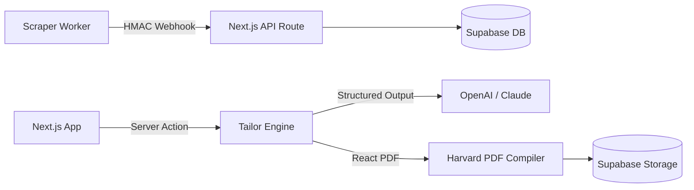

# 🛠️ Atlas — Tech Stack Specification

## Core Stack Overview

| Area | Technology | Version | Rationale |
|---|---|---|---|
| **Frontend / App** | Next.js App Router | 15.x | Server Components, Server Actions, streaming, fast SSR/ISR |
| **Language** | TypeScript | 5.5+ | End-to-end type safety across DB, AI, and UI |
| **Styling & UI** | Tailwind CSS + shadcn/ui | 3.4+ / Radix | Command Deck custom design system, zero runtime CSS |
| **Icons** | Lucide React | Latest | Crisp technical telemetry iconography |
| **Database & Auth** | Supabase (PostgreSQL 16) | 2.45+ | RLS, Auth JWT, pgvector capabilities, Storage for PDFs |
| **AI / LLM** | OpenAI API / Anthropic API | GPT-4o / Claude 3.5 Sonnet | Structured Outputs (Strict JSON Schema) |
| **PDF Generation** | @react-pdf/renderer | 3.4+ | Pure Node.js/React standard Harvard format CV rendering |
| **Worker / Scraper** | Python + Playwright / httpx | 3.11+ | Lightweight scraping, async scheduling, remote job board parsing |
| **Background Queues** | BullMQ + Redis / APScheduler | 5.14+ | Reliable background scraping and webhook ingestion |

## Integration Flow

